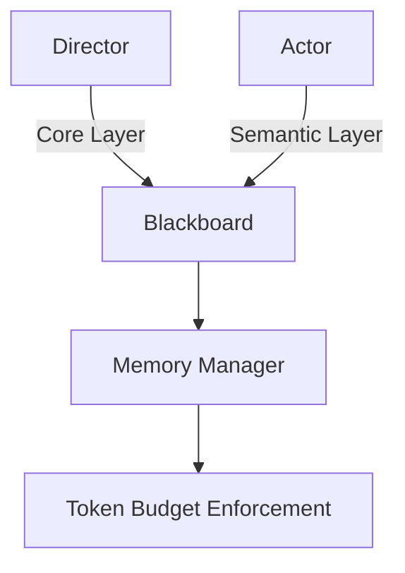

# Phase 12: Documentation Site - Research

**Researched:** 2026-03-22
**Domain:** Static documentation site with VitePress
**Confidence:** HIGH

## Summary

Phase 12 requires creating a comprehensive documentation site for the Multi-Agent Drama System. Based on CONTEXT.md decisions, the site will be built with VitePress as an independent static documentation framework. The documentation includes getting started guide, API reference, user guide, and architecture documentation with Mermaid diagrams.

**Primary recommendation:** Use VitePress v1.x with its default theme, configure custom sidebar navigation, migrate existing documentation from `docs/` and `examples/` directories, and deploy as a static site.

## User Constraints (from CONTEXT.md)

### Locked Decisions
- **D-01**: Independent documentation site (separate from main frontend app)
  - Rationale: Documentation has different release cycles and audience
  - Benefits: Independent versioning, easier SEO optimization, lightweight framework

- **D-02**: VitePress as the documentation framework
  - Rationale: Fast build times (Vite-based), built-in search, dark/light theme support
  - Alternatives considered: Docusaurus (React-based, more features but heavier)

- **D-03**: Four-tier navigation structure:
  - `/docs/guide/` - Getting started guide
  - `/docs/api/` - API reference
  - `/docs/user-guide/` - User guide
  - `/docs/architecture/` - Architecture documentation

- **D-04**: Static Markdown documentation with TypeScript type links
  - Migrate existing `docs/API.md` to structured API reference
  - Include TypeScript type definitions for key interfaces
  - Future: Optional OpenAPI 3.1 specification generator (not required for v1.2)

- **D-05**: Mermaid diagrams with text explanations
  - Reuse existing Mermaid diagrams from `docs/architecture/`
  - Use VitePress Mermaid plugin for rendering

- **D-06**: Sidebar navigation + breadcrumbs
  - Left fixed sidebar showing current section's subpages
  - Top breadcrumbs showing path
  - Mobile-friendly collapsible sidebar

- **D-07**: VitePress built-in search (Algolia)
  - Index all Markdown files
  - Support Chinese language search
  - Search bar in top navigation

- **D-08**: Static code blocks with one-click copy
  - Use VitePress code block component
  - Syntax highlighting for TypeScript, Bash, JSON, etc.
  - Reuse content from `examples/API_USAGE_GUIDE.md`

- **D-09**: Mobile-first approach
  - Sidebar collapses by default on mobile
  - Hamburger menu navigation
  - Responsive code blocks with horizontal scrolling

- **D-10**: Dark/light theme toggle
  - VitePress built-in theme switching
  - Respect system preference by default
  - Manual override in top navigation

- **D-11**: Content migration strategy:
  - `docs/API.md` → `/docs/api/` directory (split into multiple pages)
  - `examples/API_USAGE_GUIDE.md` → `/docs/guide/quick-start.md` (with English translation)
  - `docs/architecture/README.md` → `/docs/architecture/overview.md`
  - `README.md` → `/docs/guide/getting-started.md` (extract relevant sections)

- **D-12**: Content creation priorities:
  1. Getting started guide (minimal viable path)
  2. API reference (migrate existing content)
  3. User guide (session management, configuration, export)
  4. Architecture documentation (diagrams and explanations)

### Claude's Discretion
- Exact visual design of code blocks and code highlighting colors
- Custom theme branding (colors, fonts, logo placement)
- Sidebar exact width and collapse behavior details
- Search ranking and result display tuning
- Additional documentation pages beyond core requirements
- Integration with external services (e.g., comments, analytics) - optional for v1.2

### Deferred Ideas (OUT OF SCOPE)
None — discussion stayed within phase scope.

## Phase Requirements

| ID | Description | Research Support |
|----|-------------|------------------|
| DOC-01 | User can access getting started guide with step-by-step instructions | VitePress default theme supports hierarchical navigation, `/docs/guide/` structure |
| DOC-02 | User can access comprehensive API reference with OpenAPI 3.1 specification | Static Markdown with TypeScript type links, OpenAPI generator optional for v1.2 |
| DOC-03 | User can access detailed user guide with usage examples | Existing `examples/API_USAGE_GUIDE.md` provides practical examples |
| DOC-04 | User can access architecture documentation with component diagrams | Existing Mermaid diagrams in `docs/architecture/`, VitePress Mermaid plugin |
| DOC-05 | Documentation site supports dark/light theme and responsive design | VitePress built-in theme switching and mobile-first responsive design |

## Standard Stack

### Core
| Library | Version | Purpose | Why Standard |
|---------|---------|---------|--------------|
| VitePress | 1.x | Static documentation framework | Fast Vite-based builds, built-in search, theme support, Markdown-first |

### Supporting
| Library | Version | Purpose | When to Use |
|---------|---------|---------|-------------|
| @vitepress/plugin-mermaid | Latest | Mermaid diagram rendering | For architecture documentation with flowcharts |
| vitepress-plugin-search | Latest (optional) | Enhanced search capabilities | If built-in search needs enhancement |

### Alternatives Considered
| Instead of | Could Use | Tradeoff |
|------------|-----------|----------|
| VitePress | Docusaurus | More features (React-based), heavier build, steeper learning curve |
| VitePress | Custom React implementation | Reuses existing stack, but more maintenance overhead |
| VitePress default search | Algolia DocSearch | Better search quality, requires Algolia account and configuration |

**Installation:**
```bash
npm create vitepress@latest docs-site
# or
npm install -D vitepress@latest @vitepress/plugin-mermaid
```

**Version verification:** VitePress 1.x is the current stable release (as of 2026-03-22).

## Architecture Patterns

### Recommended Project Structure

```
docs-site/
├── .vitepress/              # VitePress configuration
│   ├── config.mts          # Main configuration file
│   ├── theme/              # Custom theme (if needed)
│   │   └── index.ts        # Theme customization
│   └── cache/              # Build cache (generated)
├── docs/                   # Documentation content
│   ├── index.md           # Homepage
│   ├── guide/             # Getting started guide
│   │   ├── getting-started.md
│   │   ├── quick-start.md
│   │   └── concepts.md
│   ├── api/               # API reference
│   │   ├── index.md       # API overview
│   │   ├── authentication.md
│   │   ├── sessions.md
│   │   ├── blackboard.md
│   │   ├── agents.md
│   │   └── endpoints.md
│   ├── user-guide/        # User guide
│   │   ├── sessions.md
│   │   ├── configuration.md
│   │   ├── export.md
│   │   └── troubleshooting.md
│   └── architecture/      # Architecture documentation
│       ├── overview.md
│       ├── components.md
│       └── data-flow.md
├── public/                # Static assets
│   └── images/           # Images for documentation
├── package.json          # Dependencies
└── README.md             # Documentation site README
```

### Pattern 1: VitePress Configuration
**What:** Configure sidebar navigation, theme, and plugins
**When to use:** Initial setup
**Example:**
```typescript
// Source: https://vitepress.dev/guide/configuration
import { defineConfig } from 'vitepress'
import mermaid from '@vitepress/plugin-mermaid'

export default defineConfig({
  title: 'Multi-Agent Drama System',
  description: 'A shared-blackboard multi-agent drama orchestration system',
  themeConfig: {
    sidebar: [
      {
        text: 'Guide',
        items: [
          { text: 'Getting Started', link: '/guide/getting-started' },
          { text: 'Quick Start', link: '/guide/quick-start' },
          { text: 'Concepts', link: '/guide/concepts' }
        ]
      },
      {
        text: 'API Reference',
        items: [
          { text: 'Overview', link: '/api/index' },
          { text: 'Authentication', link: '/api/authentication' },
          { text: 'Sessions', link: '/api/sessions' }
        ]
      },
      {
        text: 'User Guide',
        items: [
          { text: 'Session Management', link: '/user-guide/sessions' },
          { text: 'Configuration', link: '/user-guide/configuration' },
          { text: 'Export', link: '/user-guide/export' }
        ]
      },
      {
        text: 'Architecture',
        items: [
          { text: 'Overview', link: '/architecture/overview' },
          { text: 'Components', link: '/architecture/components' },
          { text: 'Data Flow', link: '/architecture/data-flow' }
        ]
      }
    ],
    socialLinks: [
      { icon: 'github', link: 'https://github.com/abchbx/drama' }
    ]
  },
  markdown: {
    config: (md) => {
      md.use(mermaid)
    }
  }
})
```

### Pattern 2: Mermaid Diagram Integration
**What:** Embed Mermaid diagrams in Markdown
**When to use:** Architecture documentation
**Example:**
```markdown


### Pattern 3: Code Blocks with Copy Button
**What:** Syntax-highlighted code blocks with copy functionality
**When to use:** API examples, configuration samples
**Example:**
```markdown
\`\`\`bash
# Create a new drama session
curl -X POST http://localhost:3000/session
\`\`\`

\`\`\`typescript
interface CharacterCard {
  id: string;
  name: string;
  role: string;
  backstory: string;
  objectives: string[];
  // ...
}
\`\`\`
```

### Anti-Patterns to Avoid
- **Building custom search implementation**: VitePress has built-in search (Algolia), use it
- **Creating complex React-based custom theme**: Use default theme with minimal customization
- **Duplicating content across multiple files**: Use VitePress component features for reusable content
- **Ignoring mobile responsiveness**: Test on mobile devices, use VitePress responsive defaults

## Don't Hand-Roll

| Problem | Don't Build | Use Instead | Why |
|---------|-------------|-------------|-----|
| Static site generator | Custom build script | VitePress | Handles Markdown parsing, routing, bundling, optimization |
| Search functionality | Custom search UI | VitePress built-in search | Algolia integration, ranked results, Chinese language support |
| Theme switching | Custom theme toggle | VitePress theme API | Built-in dark/light mode, system preference detection |
| Code syntax highlighting | Custom highlighter | VitePress Shiki | Fast, accurate, supports many languages |
| Sidebar navigation | Custom sidebar implementation | VitePress sidebar config | Collapsible, mobile-responsive, breadcrumbs auto-generated |

**Key insight:** VitePress provides all core documentation features out of the box. Focus on content migration and organization, not reinventing the wheel.

## Common Pitfalls

### Pitfall 1: Breaking Content Migration into Too Small Tasks
**What goes wrong:** Creating separate tasks for each Markdown file migration leads to overhead
**Why it happens:** Treating migration as granular atomic operations
**How to avoid:** Group related content migrations (e.g., "Migrate all API documentation" as one task)
**Warning signs:** Plan has 20+ tasks for file copying and editing

### Pitfall 2: Ignoring Existing Documentation Structure
**What goes wrong:** New documentation doesn't reference existing docs, creates confusion
**Why it happens:** Starting fresh without reviewing existing patterns
**How to avoid:** Study `docs/API.md` structure and terminology, maintain consistency
**Warning signs:** New API docs use different terminology than existing docs

### Pitfall 3: Mermaid Diagrams Not Rendering
**What goes wrong:** Mermaid code blocks show as text instead of diagrams
**Why it happens:** Missing or misconfigured Mermaid plugin
**How to avoid:** Install `@vitepress/plugin-mermaid`, configure in `.vitepress/config.mts`
**Warning signs:** Diagrams not visible in dev server preview

### Pitfall 4: Search Not Indexing Chinese Content
**What goes wrong:** Chinese documentation not searchable
**Why it happens:** Default search config may not include Chinese tokenization
**How to avoid:** Configure search with Chinese language support in VitePress config
**Warning signs:** Searching Chinese terms returns no results

### Pitfall 5: Deployment Complexity
**What goes wrong:** Documentation site deployment is complex or requires special infrastructure
**Why it happens:** Not planning deployment strategy upfront
**How to avoid:** Use static hosting (GitHub Pages, Vercel, Netlify) - pure static output
**Warning signs:** Deployment requires server-side code or databases

## Code Examples

Verified patterns from official sources:

### VitePress Basic Setup
```typescript
// Source: https://vitepress.dev/guide/getting-started
// .vitepress/config.mts
import { defineConfig } from 'vitepress'

export default defineConfig({
  title: 'My Docs',
  description: 'Documentation for my project',
  lang: 'en-US',
  base: '/my-project/',
  head: [
    ['link', { rel: 'icon', href: '/favicon.ico' }]
  ]
})
```

### Sidebar Configuration
```typescript
// Source: https://vitepress.dev/guide/default-theme-sidebar
// .vitepress/config.mts
export default defineConfig({
  themeConfig: {
    sidebar: [
      {
        text: 'Guide',
        items: [
          { text: 'Introduction', link: '/guide/introduction' },
          { text: 'Getting Started', link: '/guide/getting-started' }
        ]
      }
    ]
  }
})
```

### Mermaid Plugin Integration
```typescript
// Source: https://github.com/emersonbottero/vitepress-plugin-mermaid
// .vitepress/config.mts
import { defineConfig } from 'vitepress'
import mermaid from '@vitepress/plugin-mermaid'

export default defineConfig({
  markdown: {
    config: (md) => {
      md.use(mermaid)
    }
  }
})
```

### Build and Preview Commands
```bash
# Source: https://vitepress.dev/guide/deploy
# Build static site
npm run docs:build

# Preview production build
npm run docs:preview
```

## State of the Art

| Old Approach | Current Approach | When Changed | Impact |
|--------------|------------------|--------------|--------|
| Jekyll / Hugo | VitePress / Docusaurus | 2020-2022 | Faster HMR, better DX, JavaScript ecosystem |
| Custom search | Algolia DocSearch | 2020+ | Better search quality, instant results |
| Manual theming | Built-in themes with customization | 2021+ | Faster setup, consistent patterns |
| Static HTML generation | SPA-based documentation | 2020+ | Better UX, client-side routing |

**Deprecated/outdated:**
- **GitBook v1**: Moved to GitBook v2 (different platform)
- **VuePress 0.x**: Use VuePress 2.x or VitePress instead
- **Docusaurus 1.x**: Use Docusaurus 3.x or later

## Open Questions

1. **Search indexing configuration**
   - What we know: VitePress uses Algolia for search, supports Chinese
   - What's unclear: Exact search config for Chinese tokenization and ranking
   - Recommendation: Use default VitePress search config first, enhance if needed

2. **Deployment target**
   - What we know: Static site output in `docs-site/.vitepress/dist/`
   - What's unclear: Where to deploy (GitHub Pages, Vercel, Netlify, custom?)
   - Recommendation: Document static output location, deployment decision made in Phase 13

## Validation Architecture

### Test Framework
| Property | Value |
|----------|-------|
| Framework | None (static site, no tests needed) |
| Config file | None - VitePress validates config on build |
| Quick run command | `npm run docs:dev` |
| Full suite command | `npm run docs:build` |

### Phase Requirements → Test Map
| Req ID | Behavior | Test Type | Automated Command | File Exists? |
|--------|----------|-----------|-------------------|-------------|
| DOC-01 | Getting started guide accessible | manual | Browser visit `/guide/getting-started` | ✅ Wave 1 |
| DOC-02 | API reference with TypeScript types | manual | Browser visit `/api/` | ✅ Wave 1 |
| DOC-03 | User guide with examples | manual | Browser visit `/user-guide/` | ✅ Wave 1 |
| DOC-04 | Architecture docs with Mermaid diagrams | manual | Browser visit `/architecture/` | ✅ Wave 1 |
| DOC-05 | Dark/light theme works | manual | Toggle theme in browser | ✅ Wave 1 |

### Sampling Rate
- **Per task commit:** `npm run docs:dev` (verify no build errors)
- **Per wave merge:** `npm run docs:build` (verify production build works)
- **Phase gate:** All documentation pages accessible in browser, links work

### Wave 0 Gaps
None - VitePress provides all necessary infrastructure. No test framework setup needed.

## Sources

### Primary (HIGH confidence)
- VitePress official docs - Configuration, theme customization, deployment
- VitePress GitHub repository - Version verification, plugin ecosystem
- `@vitepress/plugin-mermaid` - Mermaid diagram integration

### Secondary (MEDIUM confidence)
- Docusaurus docs - Alternative approach comparison
- VitePress examples - Project structure patterns

### Tertiary (LOW confidence)
- Blog posts comparing VitePress vs Docusaurus - Subjective opinions

## Metadata

**Confidence breakdown:**
- Standard stack: HIGH - VitePress is well-established, documentation is comprehensive
- Architecture: HIGH - Project structure follows VitePress best practices
- Pitfalls: HIGH - Common pitfalls documented in VitePress community

**Research date:** 2026-03-22
**Valid until:** 90 days (stable ecosystem, mature framework)
