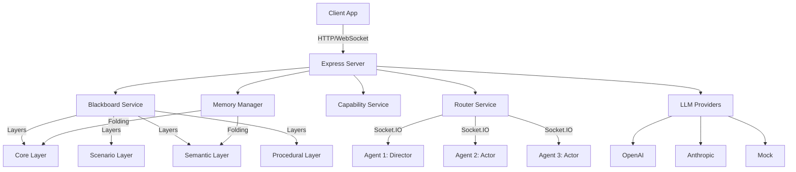

# Architecture Overview

The Multi-Agent Drama System is built on a **decentralized communication + centralized memory** hybrid pattern, enabling multiple AI agents to collaborate on dramatic narratives while maintaining context consistency and role-based boundaries.

## System Diagram

## Core Design Principles

### 1. Shared Blackboard

**Purpose:** Centralized state store that replaces full-prompt re-injection

**Benefits:**
- Eliminates context drift between agents
- Provides single source of truth for narrative state
- Enables selective reading based on agent permissions

**Implementation:** [src/services/blackboard.ts](../../src/services/blackboard.ts)

### 2. Four-Layer Memory Model

**Purpose:** Simulate human cognition with hierarchical memory

**Layers:**
- **Core:** Durable, high-value facts (never folds)
- **Scenario:** Current scene state and progression
- **Semantic:** Character cards, memories, interpretations
- **Procedural:** Execution state, workflow traces

**Implementation:** [src/services/memoryManager.ts](../../src/services/memoryManager.ts)

### 3. Role-Based Boundaries

**Purpose:** Enforce cognitive boundaries programmatically

**Mechanism:**
- Capability service validates layer access by role
- Actors can only read/write semantic and procedural layers
- Directors can read all, write core/scenario/procedural
- Admins have full access

**Implementation:** [src/services/capability.ts](../../src/services/capability.ts)

### 4. Real-Time Routing

**Purpose:** Enable real-time agent communication

**Modes:**
- **Broadcast:** Send to all agents
- **Multicast:** Send to agent groups
- **Peer-to-Peer:** Send to specific agent

**Implementation:** [src/services/router.ts](../../src/services/router.ts) with Socket.IO

### 5. LLM Abstraction

**Purpose:** Swappable LLM providers without agent code changes

**Providers:**
- OpenAI (GPT models)
- Anthropic (Claude models)
- Mock (Testing without real API calls)

**Implementation:** [src/services/llmProvider.ts](../../src/services/llmProvider.ts)

## Component Relationships

### Vertical Control Flow

Director → Blackboard → Trigger scene start signals

### Horizontal Perception Flow

Router → All Agents → Update local mental models

### Bidirectional Sync Flow

All Agents ↔ Blackboard → Submit state summaries and pull latest global views

## Data Flow Patterns

### 1. Session Initialization
1. Client requests new session → `POST /session`
2. Server creates `DramaSession` instance
3. Returns unique `dramaId`
4. All subsequent operations reference `dramaId`

### 2. Agent Registration
1. Client requests agent registration → `POST /blackboard/agents/register`
2. Capability service validates role
3. Blackboard service issues JWT token
4. Token encodes `agentId` and `role`
5. Agent uses token for authenticated operations

### 3. Message Write Flow
1. Agent writes entry → `POST /blackboard/layers/:layer/entries`
2. Capability service validates layer permission
3. Blackboard service checks token budget
4. Optimistic locking version check
5. Entry written to layer
6. Audit log appended
7. If budget exceeded → Trigger memory fold

### 4. Memory Fold Flow
1. Memory manager detects budget exceeded (100%)
2. Generate summary of layer entries
3. Write summary to scenario layer
4. Remove old entries to free space
5. Core layer never folds (hard guarantee)

## Next Steps

- [Components](/architecture/components.md) - Detailed component documentation
- [Data Flow](/architecture/data-flow.md) - Request/response flow diagrams
- [API Reference](/api/index.md) - HTTP API documentation
